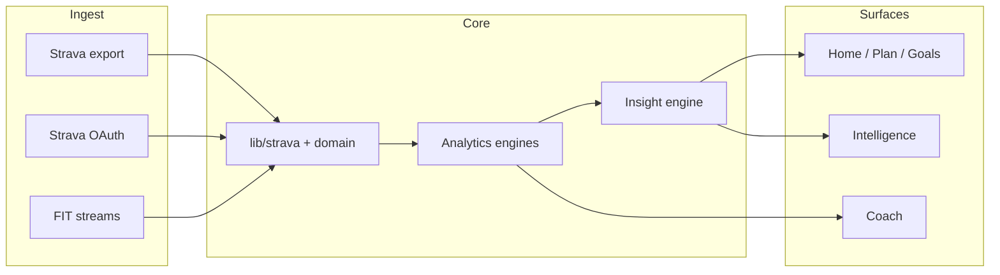

<div align="center">

# StrideIQ

**Private training intelligence for runners**

Import Strava data. Get evidence-backed insights. Plan your week. Investigate *why* with a tool-grounded Coach.

[Quick start](#quick-start) · [Features](#features) · [Deploy](#deploy) · [Docs](#documentation)

</div>

---

StrideIQ is a **local-first** Next.js app that turns Strava exports (or live API sync) into a coherent training operating system — not another chart dashboard. Deterministic engines compute metrics; the Coach and LLM layers **orchestrate tools** and must not invent numbers.

> **Repository:** `StravaFitnessTool` on GitHub · **Product name:** StrideIQ  
> **Status:** MVP (`v0.1.0-mvp`) — private beta

---

## Table of contents

- [Why StrideIQ](#why-strideiq)
- [Features](#features)
- [How it works](#how-it-works)
- [Quick start](#quick-start)
- [Configuration](#configuration)
- [Deploy](#deploy)
- [Routes](#routes)
- [Coach, API & MCP](#coach-api--mcp)
- [Development](#development)
- [Documentation](#documentation)
- [Tech stack](#tech-stack)
- [License](#license)

---

## Why StrideIQ

| Typical Strava tooling | StrideIQ |
|------------------------|----------|
| Charts and totals | Question-led surfaces (“Am I ready?” “What changed?”) |
| Static dashboards | **Athlete Intelligence Model** — curated belief state |
| Generic AI chat | **Coach** with deterministic tool-use over your data |
| Disconnected planning | **Adaptive week plan** with context, save, and execution vs actual |

**Design principle:** every screen answers one user question. Insights ship with evidence, confidence, and recommendations — not orphaned graphs.

---

## Features

### Data ingestion

- **Strava bulk export** — `activities.csv` + optional FIT `activities/` folder (two-step import)
- **Strava OAuth** — live sync to Neon Postgres
- **Webhooks** — optional background activity sync
- **Privacy-first export path** — no account or server required for core analytics

### Training intelligence

| Surface | What you get |
|---------|----------------|
| **Home** | Operating-system layout: focus, week board, change feed, decision support |
| **Plan** | Planning context, AI/rule-based week generation, drag-and-drop board, planned vs actual |
| **Goals** | Race briefing, readiness, forecasts, mission control |
| **Training & Performance** | Volume, blocks, efficiency, projections, records |
| **Runs** | Activity explorer, session intelligence, route replay (MapLibre) |
| **Intelligence** | Persistent athlete belief model — signals, memory, ecosystem (not a chat UI) |
| **Coach** | Investigation workspace — threaded reasoning with server-backed tools |
| **Report** | Printable training change summary |

### Engineering

- **218+ Vitest tests** · production `next build`
- **shadcn/ui** component layer · DM Sans + Syne typography
- **MCP package** — same intelligence tools in Claude Desktop (`packages/strideiq-mcp`)

---

## How it works



**Two runtime modes**

| Mode | Storage | Coach / sync |
|------|---------|----------------|
| **Export only** | Browser `localStorage` + IndexedDB (FIT) | Client analytics only |
| **Connected** | Neon Postgres + session cookie | Full Coach, webhooks, MCP |

---

## Quick start

### Prerequisites

- **Node.js** 20+
- **npm** 10+

### Run locally

```bash
git clone https://github.com/Padraigobrien08/StravaFitnessTool.git
cd StravaFitnessTool
npm install
cp .env.example .env.local   # optional — see paths below
npm run dev
```

Open **[http://localhost:3000](http://localhost:3000)**.

### Choose your path

| Path | Setup time | `.env.local` | Capabilities |
|------|------------|--------------|--------------|
| **A — Export only** | ~5 min | Empty or omit | Home, Training, Goals, Plan, Runs, Report, Intelligence (client) |
| **B — Full stack** | ~20 min | Strava + Neon + LLM | OAuth sync, Coach, webhooks, MCP |

Capability matrix: [docs/RELEASE_MVP.md](docs/RELEASE_MVP.md).

<details>
<summary><strong>Path A — Export only (no API keys)</strong></summary>

1. Strava → **Settings → My Account** → download your data → unzip.
2. **Import** → upload export folder (`activities.csv` required).
3. Optional: upload the `activities/` folder for FIT stream detail.
4. **Home** — confirm runs load.
5. **Goals** — set race distance and date.
6. **Plan** — add optional context → **Generate** → **Save week**.
7. **Settings** — theme toggle; **Clear data** uses a confirmation dialog.

No Strava API app or database required.

</details>

<details>
<summary><strong>Path B — OAuth + Coach</strong></summary>

1. Create a [Neon](https://neon.tech) database and apply migrations:

   ```bash
   psql "$DATABASE_URL" -f db/migrations/001_initial.sql
   psql "$DATABASE_URL" -f db/migrations/002_coach.sql
   psql "$DATABASE_URL" -f db/migrations/003_route_geometry.sql
   ```

2. Create a [Strava API application](https://www.strava.com/settings/api). For local dev, set **Authorization Callback Domain** to `localhost`.

3. Configure [`.env.local`](.env.example) (copy from [`.env.example`](.env.example)):

   ```bash
   DATABASE_URL=postgresql://...
   SESSION_SECRET=$(openssl rand -hex 32)
   STRAVA_CLIENT_ID=...
   STRAVA_CLIENT_SECRET=...
   STRAVA_REDIRECT_URI=http://localhost:3000/api/auth/strava/callback
   OPENAI_API_KEY=sk-...   # or ANTHROPIC_API_KEY
   ```

4. Restart the dev server → **Import → Connect Strava** → sync activities.
5. **Goals** → race goal → **Plan** → generate and save → **Coach** → ask a training question.

</details>

### Verify

```bash
npm test && npm run build
# or
./scripts/verify.sh
```

Manual QA: [docs/SMOKE_TEST.md](docs/SMOKE_TEST.md).

---

## Configuration

Copy [`.env.example`](.env.example) to `.env.local`. Never commit `.env.local`.

| Variable | Required for |
|----------|----------------|
| `DATABASE_URL` | Strava sync, Coach, MCP |
| `SESSION_SECRET` | Signed session cookies |
| `STRAVA_CLIENT_ID` / `SECRET` / `REDIRECT_URI` | OAuth |
| `OPENAI_API_KEY` or `ANTHROPIC_API_KEY` | Coach + AI weekly plan |
| `STRAVA_WEBHOOK_VERIFY_TOKEN` / `STRAVA_WEBHOOK_CALLBACK_URL` | Push auto-sync |
| `STRIDEIQ_API_KEY` + `STRIDEIQ_API_KEY_USER_ID` | MCP / automation |

Production values and callback URLs: [docs/DEPLOYMENT.md](docs/DEPLOYMENT.md).

---

## Deploy

Hosted stack: **Vercel** (app) + **Neon** (database) + **Strava** (OAuth + optional webhooks).

| Step | Guide |
|------|--------|
| Neon migrations | [docs/DEPLOYMENT.md § Neon](docs/DEPLOYMENT.md#1-neon-database) |
| Strava callback & webhook URLs | [docs/DEPLOYMENT.md § Strava](docs/DEPLOYMENT.md#2-strava-api-application) |
| Vercel env vars | [docs/DEPLOYMENT.md § Vercel](docs/DEPLOYMENT.md#3-vercel-project) |
| Post-deploy smoke test | [docs/SMOKE_TEST.md](docs/SMOKE_TEST.md) Path C |

---

## Routes

| Route | Purpose |
|-------|---------|
| `/home` | Training operating system — focus, week, insights |
| `/plan` | Adaptive week workspace |
| `/goals` | Race readiness and forecasts |
| `/training` | Volume, blocks, load intelligence |
| `/performance` | Trends, records, projections |
| `/runs` | Activity explorer |
| `/runs/[id]` | Session execution analysis |
| `/runs/[id]/route` | GPS replay (pace, HR, elevation) |
| `/intelligence` | Athlete Intelligence Model |
| `/coach` | Investigation chat |
| `/report` | Printable summary |
| `/import` | CSV, FIT, Strava OAuth |
| `/settings` | Units, privacy, webhooks, data quality |

Legacy chart routes (`/dashboard`, `/trends`, `/effort`, `/records`, `/context`) remain for compatibility.

Coach deep links from Intelligence: `?domain=…`, `?q=…`, `?topic=…`, `&investigate=1`.

---

## Coach, API & MCP

### In-app Coach

- Investigation UI: thread, composer, sidebar, context rail
- `POST /api/chat` — OpenAI (preferred) or Anthropic with **tool-use**
- Threads in browser `localStorage`

### HTTP intelligence API

```http
GET /api/me/intelligence?section=brief|readiness|compare_sessions|...
```

Auth: session cookie (browser) or `STRIDEIQ_API_KEY` + `STRIDEIQ_API_KEY_USER_ID`.

### Reasoning tools (deterministic)

| Tool | Purpose |
|------|---------|
| `compare_sessions` | Compare recent workouts |
| `explain_readiness_delta` | Why readiness moved |
| `find_best_phase` | Strongest training phases |
| `attribute_improvement` | Patterns before gains |
| `analyze_fade_pattern` | Late-run pace fade |
| `pr_context` | Training before PRs |
| `get_training_ecosystem` | Multi-sport fatigue context |

Full tool catalog: [docs/ARCHITECTURE.md](docs/ARCHITECTURE.md).

### MCP (Claude Desktop)

```bash
cd packages/strideiq-mcp && npm install && npm run build
```

Setup: [packages/strideiq-mcp/README.md](packages/strideiq-mcp/README.md).

---

## Development

### Project structure

```
app/                      # Next.js App Router (pages + API)
components/               # Feature UI (coach, plan, home, goals, …)
components/ui/            # shadcn/ui primitives
lib/
  strava/ domain/         # Ingest + normalized activities
  analytics/ insights/  # Metrics + narratives
  intelligence/         # Server bundle, tools, chat
  reasoning/            # Deterministic reasoning primitives
  training-calendar/    # Plan persistence & validation
hooks/                    # Data hooks for pages
db/migrations/            # Postgres schema
packages/strideiq-mcp/    # MCP server
docs/                     # Architecture, deploy, smoke tests
```

**Rule:** UI consumes domain models and view models — never raw Strava CSV rows.

### Scripts

| Command | Description |
|---------|-------------|
| `npm run dev` | Development server |
| `npm run build` | Production build |
| `npm run start` | Start production server |
| `npm test` | Vitest test suite |
| `./scripts/verify.sh` | Test + build gate |

### FIT import note

Strava CSV often references `activities/<id>.fit.gz` without bundling files. Upload the export folder first, then the `activities/` directory from your full archive. FIT streams are stored in IndexedDB and power route replay and stream intelligence.

### Webhooks

| Endpoint | Purpose |
|----------|---------|
| `GET/POST /api/webhooks/strava` | Verification + activity events |
| `GET/POST /api/webhooks/strava/subscribe` | Subscription management |

Enable from **Settings** after OAuth is connected. Refresh the app after webhook events (no live push to the client yet).

---

## Documentation

| Document | Description |
|----------|-------------|
| [docs/README.md](docs/README.md) | Documentation index |
| [PRODUCT.md](PRODUCT.md) | Product contract and IA rules |
| [docs/FEATURES.md](docs/FEATURES.md) | Complete feature catalog |
| [docs/ARCHITECTURE.md](docs/ARCHITECTURE.md) | Layers, data flow, API |
| [docs/COACH_AND_INTELLIGENCE.md](docs/COACH_AND_INTELLIGENCE.md) | Intelligence vs Coach |
| [docs/DEPLOYMENT.md](docs/DEPLOYMENT.md) | Vercel + Neon + Strava production setup |
| [docs/SMOKE_TEST.md](docs/SMOKE_TEST.md) | Manual release checklist |
| [docs/RELEASE_MVP.md](docs/RELEASE_MVP.md) | MVP scope and API requirements |
| [docs/DIFFERENTIATION_NORTH_STAR.md](docs/DIFFERENTIATION_NORTH_STAR.md) | Future moat features |

---

## Tech stack

| Layer | Technology |
|-------|------------|
| Framework | Next.js 16, React 19, TypeScript |
| UI | Tailwind CSS v4, shadcn/ui (Base UI), Recharts, MapLibre GL |
| State | Zustand |
| Data | Papa Parse, fit-file-parser, Zod |
| Database | Neon Postgres (`@neondatabase/serverless`) |
| LLM | OpenAI / Anthropic (Coach, optional planning) |
| Testing | Vitest |

---

## Known MVP limitations

- Unit preference is saved in Settings; chart labels remain km-centric until a future release.
- Saved training weeks live in browser `localStorage` (not synced per user to Neon).
- Coach and full intelligence bundle require server env and LLM keys.
- See [docs/RELEASE_MVP.md](docs/RELEASE_MVP.md) for the full list.

---

## License

Private project — not licensed for public redistribution unless otherwise noted.

---

<div align="center">

**[StrideIQ](https://github.com/Padraigobrien08/StravaFitnessTool)** · Built for runners who want answers, not just activity logs.

</div>
