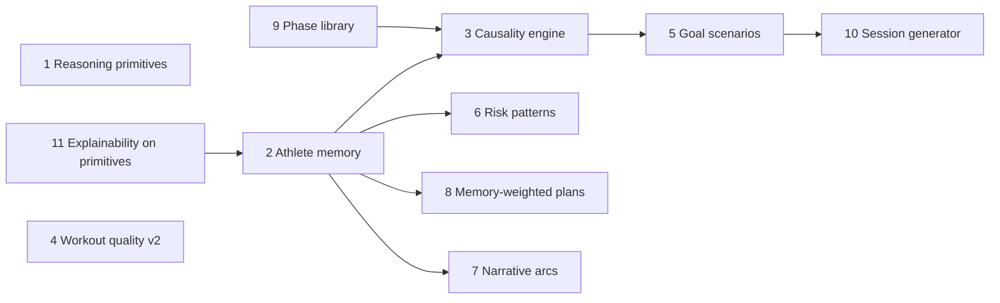

# StrideIQ — Differentiation North Star

**Positioning shift:** From “training dashboard + chat over metrics” to **interactive endurance reasoning** backed by **personal adaptation intelligence**.

Strava answers _what happened_. StrideIQ should answer **why it happened, what it means for you specifically, and what historically works for your body** — with evidence, confidence, and limits stated every time.

---

## What is genuinely differentiated?

| Tier                 | Meaning                                                                    |
| -------------------- | -------------------------------------------------------------------------- |
| **A — Moat**         | Hard to copy without your data model + longitudinal logic + explainability |
| **B — Strong**       | Valuable if evidence-grounded; many apps claim it but do poorly            |
| **C — Table stakes** | Required for trust; not a differentiator alone                             |

| #   | Capability                                      | Tier          | Why it’s defensible                                                  |
| --- | ----------------------------------------------- | ------------- | -------------------------------------------------------------------- |
| 1   | Conversational training intelligence            | **A**         | Follow-up reasoning over _your_ history beats static dashboards      |
| 2   | Training memory (longitudinal athletic profile) | **A**         | Personal adaptation rules mined from blocks — Strava doesn’t do this |
| 3   | Training causality engine                       | **A**         | “What likely caused improvement” with historical grounding           |
| 4   | Workout quality scoring                         | **B→A**       | Coach-like execution dimensions; you have FIT foundation             |
| 5   | Adaptive goal engine (probability-adjusted)     | **A**         | Scenarios + requirements, not single predicted time                  |
| 6   | Training risk intelligence                      | **B**         | Safe if historical, not medical — you already frame this way         |
| 7   | AI training narrative                           | **B**         | Sticky only when tied to evidence + memory + causality               |
| 8   | Adaptive planning from adaptation profile       | **A**         | Plans from _your_ response history — huge if real                    |
| 9   | Comparative self-analysis                       | **A**         | Strongest phase / best prep block — psychologically unique           |
| 10  | AI session generator (today’s workout)          | **B→A**       | One perfect session > generic week grid                              |
| 11  | Explainability layer                            | **A** (trust) | Moat via _consistency_ — every surface answers “why?”                |

**Not differentiated (avoid selling these):** generic charts, social comparison, calorie maps, “AI coach” black boxes without tools, single race-time calculators without scenario logic.

---

## Current codebase vs north star

| #      | Vision                          | Today (honest)                                                                                    | Gap                                                                     |
| ------ | ------------------------------- | ------------------------------------------------------------------------------------------------- | ----------------------------------------------------------------------- |
| **1**  | Interactive endurance reasoning | `/coach` + MCP: reasoning + ecosystem **tools**, OpenAI/Anthropic loop; `/intelligence` belief UI | Deeper causality chains, memory-weighted planning                       |
| **2**  | Training memory                 | `bestBlock`, memory snippets, Intelligence tiles, workspace state                                 | No formal **AthleteMemory** profile object persisted across seasons     |
| **3**  | Causality engine                | Efficiency MoM, intensity advice, block highlights                                                | No **period attribution** or multi-factor causal scoring                |
| **4**  | Workout quality                 | Run detail: quality 0–100, pacing stability, HR drift, fade                                       | Missing: interval repeatability, decoupling index, threshold HR control |
| **5**  | Adaptive goals                  | Consensus predictions + spread; readiness score                                                   | No **scenario engine**: “1:45 requires +15% volume…”                    |
| **6**  | Training risk                   | Fatigue TSB, goal risks, intensity advisor                                                        | No **pattern memory**: “this pattern preceded drop-offs before”         |
| **7**  | Narratives                      | `buildWeeklyNarrative`, insights, report brief                                                    | No monthly / pre-race / block-linked **story arcs**                     |
| **8**  | Adaptive planning               | `planEngine` + race week; uses fatigue/readiness                                                  | Not tied to **historical response profile**                             |
| **9**  | Comparative self                | `bestBlock`, PR timeline, prediction trajectory                                                   | No ranked **phase catalog** or “compare phase A vs B”                   |
| **10** | Session generator               | Week plan sessions                                                                                | No **single-session** generator for today (fatigue + time budget)       |
| **11** | Explainability                  | Envelopes, explain panels, confidence badges                                                      | Strong UI; coach must **always** surface tool evidence                  |

**Foundation already strong:** domain model, FIT streams, `computeInsights`, readiness, predictions, plan engine, execution analysis on run detail, MCP/API wiring.

---

## The product stack (target architecture)

```
┌─────────────────────────────────────────────────────────────┐
│  Conversational reasoning layer (LLM orchestrator)          │
│  — follow-ups, synthesis, language                          │
│  — NEVER invents metrics; calls engines + memory            │
└───────────────────────────┬─────────────────────────────────┘
                            │
┌───────────────────────────▼─────────────────────────────────┐
│  Reasoning primitives (NEW — deterministic, testable)         │
│  compare_sessions · explain_readiness_delta · find_best_phase │
│  attribute_improvement · fade_analysis · pr_context           │
│  goal_scenarios · session_for_today · risk_pattern_match      │
└───────────────────────────┬─────────────────────────────────┘
                            │
┌───────────────────────────▼─────────────────────────────────┐
│  Athletic memory + causality (NEW — longitudinal)             │
│  AthleteMemoryProfile · PhaseLibrary · CausalAttribution      │
└───────────────────────────┬─────────────────────────────────┘
                            │
┌───────────────────────────▼─────────────────────────────────┐
│  Existing engines (KEEP — source of truth)                  │
│  computeInsights · planEngine · predictions · readiness     │
│  workoutDetail · raceStrategy · fatigue · consistency       │
└─────────────────────────────────────────────────────────────┘
```

Chat/MCP becomes a **reasoning orchestrator** over primitives — not a wrapper on `GET /import`.

---

## Feature specs (what “done” looks like)

### 1. Conversational training intelligence

**User examples → primitive mapping**

| Question                          | Engine / tool                          |
| --------------------------------- | -------------------------------------- |
| Why did HM readiness drop?        | `explain_readiness_delta(weeks=1)`     |
| Compare last 3 threshold sessions | `compare_sessions(type=tempo, n=3)`    |
| Strongest aerobic block?          | `find_best_phase(metric=aerobic)`      |
| Why fade after 15 km?             | `analyze_fade_pattern(distance_km=15)` |
| What changed before PR?           | `pr_context(pr_id)`                    |
| What training improved pace most? | `attribute_improvement(metric=pace)`   |

**Coach system prompt upgrade:** “You are an endurance reasoning system. Use comparison and attribution tools before explaining _why_. State confidence and missing data.”

---

### 2. Training memory system

**Output shape (stored + refreshed on sync):**

```ts
interface AthleteMemoryProfile {
  version: number;
  computedAt: string;
  confidence: "low" | "medium" | "high";
  positivePatterns: PatternRule[];  // e.g. volume band, long-run % cap
  negativePatterns: PatternRule[];
  optimalRanges: { weeklyKm: [number, number]; hardPct: [number, number]; ... };
  evidence: string[];
}
```

**Mine from:** rolling 4-week blocks, easy/hard splits, efficiency by block, race proximity, consistency streaks, post-block performance deltas.

**Surfaces:** Memory panel on Home; MCP resource `strideiq://athlete/memory`; coach always allowed to call `get_athlete_memory`.

---

### 3. Training causality engine

**Not** “pace went up.” **Instead:**

> Your 10K pace improved most in blocks with: 4 runs/week (±1), hard share &lt;22%, long-run CV &lt;8%, freshness TSB &gt; −8.

Implementation: rank historical blocks by outcome metric (pace at HR, PR progress, efficiency index); extract top correlating features with **confidence** from sample size.

**Tool:** `attribute_improvement(metric, distance?)` → ranked factors + counterfactuals.

---

### 4. Workout quality scoring (extend current)

**Already:** `buildExecution()` — quality, pacing stability, drift, late fade.

**Add dimensions:**

| Dimension              | Signal                       |
| ---------------------- | ---------------------------- |
| Interval repeatability | Lap pace CV within work reps |
| Aerobic decoupling     | Pace/HR slope long runs      |
| Threshold control      | Time in Z3–Z4 band vs target |
| Recovery effectiveness | HR recovery between reps     |

**Unified:** `WorkoutQualityReport` on every classified hard/long run; aggregate “threshold quality trend.”

---

### 5. Adaptive goal engine

**Extend** `racePredictionAnalysis` + readiness:

```ts
interface GoalScenario {
  label: "current" | "stretch" | "aggressive";
  timeRange: [sec, sec];
  probability: number; // 0–1, heuristic not medical
  requirements: string[]; // "+12% 4wk volume", "2 more threshold sessions"
  tradeoffs: string[];
}
```

**Tool:** `get_goal_scenarios(distance)` — never a single time without band + probability language.

---

### 6. Training risk intelligence

**Extend** goal risks + fatigue:

- Load volatility (week-over-week km σ)
- Intensity concentration (hard runs in 14d)
- Long-run spike vs 4-week avg
- **Historical:** “Similar pattern in Mar 2024 → consistency dropped 2 weeks later”

**Tool:** `get_sustainability_risks()` — pattern-matched, hedged language.

---

### 7. AI training narrative

**Layers:**

| Cadence  | Source                                    |
| -------- | ----------------------------------------- |
| Weekly   | `buildWeeklyNarrative` + memory + plan    |
| Monthly  | Block comparison + causality headline     |
| Pre-race | Race week + strongest prep phase citation |
| Post-run | Execution quality one-liner               |

**Rule:** Every sentence must map to `evidence[]` ids (insight id, block label, run id).

---

### 8. Adaptive planning system

**After memory exists:**

> You respond best to: moderate threshold frequency, low interval density → next 3 weeks bias aerobic maintenance + one quality touch.

`planEngine` reads `AthleteMemoryProfile` weights (not generic templates only).

---

### 9. Comparative self-analysis

**Phase library:**

```ts
interface TrainingPhase {
  id: string;
  label: string; // "Apr 23 – May 21 HM prep"
  metrics: { volume; hardPct; longestRun; efficiency; consistency };
  rank: number;
  tags: ("strongest_aerobic" | "best_race_prep" | "most_sustainable")[];
}
```

**UI:** Performance → “Your training eras”; Coach: “compare my best prep to now.”

---

### 10. AI session generator

**Input:** fatigue, days to race, minutes available, last hard day, memory profile.

**Output:** One `RecommendedSession` with structure, pace targets, HR guardrails, why.

**Distinct from** week plan — this is **today**.

**Tool:** `generate_session(minutes, intent?)`

---

### 11. Explainability layer

**Non-negotiable on every primitive:**

```ts
{ result, evidence: string[], assumptions: string[], limitations: string[], confidence }
```

Coach UI: expandable “Why this answer” with tool JSON + evidence list.

**Differentiation:** Competitors hide reasoning; you show the chain.

---

## MCP / Coach evolution (generations)

| Gen    | What                                                     | Status     |
| ------ | -------------------------------------------------------- | ---------- |
| **v0** | Fetch snapshot tools (brief, plan, readiness…)           | ✅ Shipped |
| **v1** | Reasoning primitives (compare, explain delta, attribute) | **Next**   |
| **v2** | Athlete memory + phase library                           | High moat  |
| **v3** | Goal scenarios + session-for-today                       |            |
| **v4** | Memory-weighted plan engine                              |            |

**Deprecate framing:** “chat with your running data.”  
**Use:** “Ask why — grounded in your training history.”

---

## Recommended build order (ROI × moat)



| Phase  | Deliverable                              | Unlocks                                |
| ------ | ---------------------------------------- | -------------------------------------- |
| **P1** | `lib/reasoning/*` + 6 MCP tools          | Real conversational differentiation    |
| **P2** | Evidence contract on all tools           | Trust moat                             |
| **P3** | Workout quality dimensions               | Coach-like session feedback            |
| **P4** | `TrainingPhase` + best-era UI            | Comparative self                       |
| **P5** | `AthleteMemoryProfile`                   | Memory + adaptive plan + risk patterns |
| **P6** | Causality + goal scenarios + session gen | Full north star                        |

---

## Success criteria (differentiation test)

StrideIQ is differentiated when a user can ask:

1. **“Why did readiness drop?”** → cites week-over-week deltas + specific sessions, not vibes.
2. **“Compare my last 3 thresholds”** → table of execution scores + drift + repeatability.
3. **“When was I strongest aerobically?”** → named block + metrics + comparison to now.
4. **“What would it take to run 1:45?”** → probability + concrete requirements + tradeoffs.
5. **“What should I run today?”** → one session with fatigue/race context, not a week grid.

If answers come only from a static brief snapshot, we’re still v0.

---

## What NOT to build (scope traps)

- Social leaderboards / segment KOM focus
- Nutrition / sleep integration (until data quality clear)
- Medical injury diagnosis language
- Generic 12-week PDF plans unrelated to history
- LLM-generated numbers without tool call

---

_Canonical differentiation reference. Update when shipping P1+ reasoning primitives._
