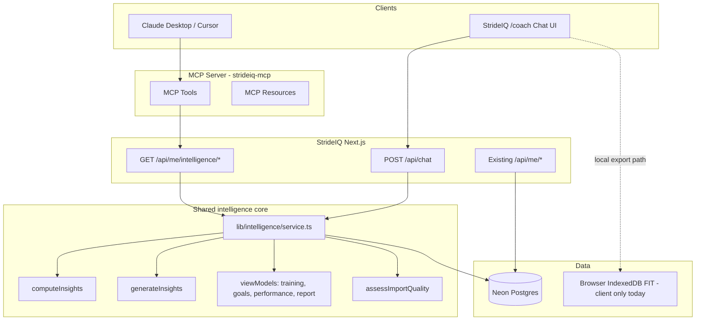
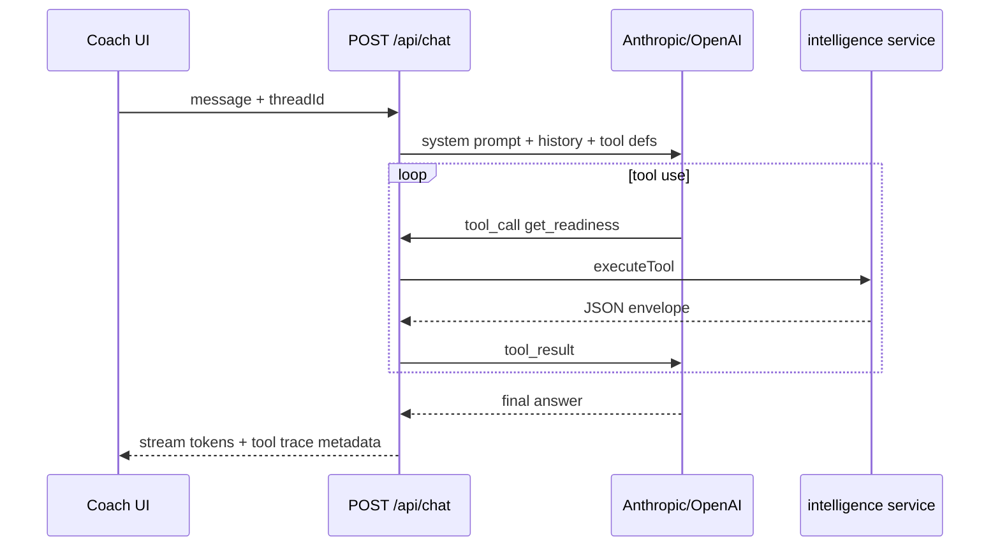

# StrideIQ MCP Server & Coach Chat — Architecture Plan

**Goal:** Let an external LLM (Claude Desktop, Cursor, API clients) **chat, analyze, predict, and plan** using the **same deterministic intelligence** as the StrideIQ UI — not raw CSV dumps or invented metrics.

**Status:** Planning (V3). Implementation should follow the phased roadmap at the end.

---

## 1. Problem statement

Today:

| Layer               | What exists                                                                                |
| ------------------- | ------------------------------------------------------------------------------------------ |
| **UI intelligence** | `computeInsights()` + `generateInsights()` + page `viewModels` — rich, tested, client-side |
| **HTTP API**        | Import JSON, FIT details, sync, status — **no pre-computed insights**                      |
| **MCP**             | Neon MCP only (DB ops), not product intelligence                                           |

If we wrap only `GET /api/me/import` in MCP tools, the LLM gets thousands of raw runs and will **hallucinate readiness, plans, and predictions**. Maximum reliability requires **structured intelligence endpoints** that return evidence-backed snapshots the UI already trusts.

---

## 2. Design principles

1. **Deterministic core, generative shell** — Numbers (readiness, predictions, week plan, TSB) come from `lib/analytics` and `lib/training/planEngine`, never from the LLM.
2. **Evidence on every answer** — Tool responses include `confidence`, `evidence[]`, `limitations[]`, `dataAsOf`.
3. **Parity with UI** — Same `computeInsights` inputs (import + FIT + race goal + settings) as `useTrainingIntelligence()`.
4. **Token-efficient briefs** — Full `DashboardInsights` is huge; offer `brief` and `section` modes for chat.
5. **One implementation, two surfaces** — Shared `lib/intelligence/service.ts` powers REST, MCP tools, and in-app `/api/chat`.
6. **Read-first, write-careful** — v1 MCP is read-only; goal updates and sync are gated tools later.

---

## 3. Target architecture



**Hosted path:** Server loads `StravaImport` + FIT from DB (`buildStravaImportFromDb` + stream JSON), merges settings/goals from DB or request context, runs `computeInsights`.

**Local-only path (optional v2):** MCP stdio server accepts a session cookie or one-time token from the running dev app; or user runs against export JSON file tools for offline dev.

---

## 4. Shared intelligence service (build first)

**New module:** `lib/intelligence/service.ts`

```ts
// Conceptual API
export type IntelligenceContext = {
  userId: string;
  raceGoal: RaceGoal | null;
  settings: { defaultWeeklyRuns: number; maxWeeklyKm?: number };
};

export async function loadAthleteDataset(ctx: IntelligenceContext): Promise<{
  import: StravaImport;
  fitDetails: FitRunDetail[];
  quality: ImportQualityReport;
}>;

export async function computeAthleteIntelligence(ctx: IntelligenceContext): Promise<{
  analytics: DashboardInsights;
  insights: Insight[];
  quality: ImportQualityReport;
}>;

export function buildIntelligenceBrief(
  bundle: Awaited<ReturnType<typeof computeAthleteIntelligence>>,
  sections?: IntelligenceSection[],
): IntelligenceBrief; // ~2–6k tokens, stable schema
```

**Persistence gaps to close for server parity:**

| Setting                            | Today                  | Server needs                              |
| ---------------------------------- | ---------------------- | ----------------------------------------- |
| Race goal                          | `zustand` localStorage | `user_goals` table or pass in API body    |
| `defaultWeeklyRuns`, `maxWeeklyKm` | settings store         | `user_settings` table or session          |
| FIT details                        | IndexedDB + API merge  | Already in `activity_streams` when synced |

**Recommendation:** Add minimal tables in migration `002_coach.sql`:

- `user_settings (user_id, default_weekly_runs, max_weekly_km, units)`
- `user_race_goals (user_id, distance, date, target_time_sec)` — mirror goal store for server/MCP

Until then, MCP/chat can accept optional `raceGoal` in tool args (validated) for planning queries.

---

## 5. REST API layer (MCP depends on this)

Extend `/api/me/*` with **session auth** (`getSessionUserId`) — same as import route.

### 5.1 Intelligence routes (new)

| Method | Route                              | Purpose                                                  |
| ------ | ---------------------------------- | -------------------------------------------------------- |
| `GET`  | `/api/me/intelligence`             | Full bundle: analytics summary + insights + quality meta |
| `GET`  | `/api/me/intelligence/brief`       | Token-efficient coach brief (default for chat)           |
| `GET`  | `/api/me/intelligence/readiness`   | Race readiness + gaps + probability band                 |
| `GET`  | `/api/me/intelligence/predictions` | `racePredictionAnalysis` + consensus only                |
| `GET`  | `/api/me/intelligence/plan`        | `nextWeekPlan` + rationale + warnings                    |
| `GET`  | `/api/me/intelligence/strategy`    | `?mode=even\|negative\|conservative\|aggressive`         |
| `GET`  | `/api/me/intelligence/fatigue`     | TSB, CTL, ATL, freshness, load history tail              |
| `GET`  | `/api/me/runs`                     | Paginated run list with workout labels                   |
| `GET`  | `/api/me/runs/[id]`                | Single run + FIT summary + classification                |

Query params:

- `sections=readiness,predictions,plan,fatigue` on `/intelligence`
- `brief=1` max token budget hint

### 5.2 Response envelope (all intelligence routes)

```json
{
  "dataAsOf": "2026-05-21T12:00:00Z",
  "confidence": "medium",
  "evidence": ["61 HR-backed runs", "12 FIT streams parsed"],
  "limitations": ["No sleep/HRV", "3 runs missing streams"],
  "payload": {}
}
```

### 5.3 Existing routes (MCP wrappers, no change required)

| Route                          | MCP tool name                                               |
| ------------------------------ | ----------------------------------------------------------- |
| `GET /api/me/status`           | `strideiq_get_connection_status`                            |
| `GET /api/me/import`           | `strideiq_get_import_metadata` (counts only, not full dump) |
| `GET /api/me/fit-details`      | `strideiq_get_fit_coverage`                                 |
| `GET /api/me/fit-details/[id]` | `strideiq_get_run_streams`                                  |
| `GET /api/me/athlete-stats`    | `strideiq_get_strava_stats`                                 |
| `POST /api/sync/strava`        | `strideiq_trigger_sync` (v2, confirm=true)                  |

---

## 6. MCP server design

### 6.1 Package layout

```
packages/strideiq-mcp/
  package.json          # @strideiq/mcp, bin strideiq-mcp
  src/
    index.ts            # stdio transport
    server.ts           # McpServer setup
    client.ts           # HTTP client → STRIDEIQ_BASE_URL + SESSION_COOKIE or API_KEY
    tools/
      intelligence.ts
      runs.ts
      connection.ts
    resources/
      brief.ts
  README.md             # Claude Desktop config snippet
```

**Env vars:**

```bash
STRIDEIQ_BASE_URL=http://localhost:3000
STRIDEIQ_API_KEY=          # v2: long-lived PAT per user
# v1 dev: STRIDEIQ_SESSION_COOKIE from browser after login
```

### 6.2 Tool catalog (v1 read-only)

| Tool                    | Description                                                                      | Backend                          |
| ----------------------- | -------------------------------------------------------------------------------- | -------------------------------- |
| `get_coach_brief`       | One-shot context: hero state, readiness, next week, top 3 insights, data quality | `/intelligence/brief`            |
| `get_readiness`         | Race/HM readiness score, gaps, days to race                                      | `/intelligence/readiness`        |
| `get_predictions`       | Consensus times, confidence, primary anchor run                                  | `/intelligence/predictions`      |
| `get_week_plan`         | Sessions by day, template, rationale                                             | `/intelligence/plan`             |
| `get_race_strategy`     | Splits, fade risk, narrative for mode                                            | `/intelligence/strategy`         |
| `get_fatigue_load`      | Freshness, TSB, trend note                                                       | `/intelligence/fatigue`          |
| `list_recent_runs`      | Last N runs with type, distance, pace, date                                      | `/runs?limit=`                   |
| `get_run_analysis`      | Workout detail view model for one run                                            | `/runs/[id]`                     |
| `get_data_quality`      | Field coverage, warnings, FIT %                                                  | derived from intelligence bundle |
| `get_connection_status` | API connected, stream gaps                                                       | `/me/status`                     |

### 6.3 MCP resources (large context)

| URI                              | Content                              |
| -------------------------------- | ------------------------------------ |
| `strideiq://athlete/brief`       | Latest `IntelligenceBrief` markdown  |
| `strideiq://athlete/plan`        | Current week plan as structured JSON |
| `strideiq://athlete/predictions` | Prediction consensus table           |

Resources refresh on read (no stale cache > 5 min in v1).

### 6.4 Tool design rules for LLM reliability

- **Narrow tools** beat one mega-tool — forces the model to fetch the right slice.
- **Always return `limitations`** when confidence &lt; high.
- **Never return full `activities.csv` shape** — use `list_recent_runs` + `get_run_analysis`.
- **Race goal**: tool `get_week_plan` reads server goal; optional arg `raceDate` + `distance` only for what-if (computed ephemeral, not saved) in v2.
- **Idempotent reads** — safe to call repeatedly in a tool loop.

### 6.5 Example Claude Desktop config

```json
{
  "mcpServers": {
    "strideiq": {
      "command": "npx",
      "args": ["-y", "@strideiq/mcp"],
      "env": {
        "STRIDEIQ_BASE_URL": "http://localhost:3000",
        "STRIDEIQ_API_KEY": "your-pat"
      }
    }
  }
}
```

---

## 7. Coach chat interface (`/coach`)

### 7.1 UX goals

- Feels like **“Ask your training intelligence”** — not a generic chatbot.
- Shows **confidence + data freshness** in the chrome.
- Suggested prompts aligned with the five product questions: improving, training, ready, next, changed.
- Citations link to StrideIQ pages (`/training`, `/goals`, `/runs/[id]`).

### 7.2 IA

```
/coach
├── CoachWorkspace (matches Training/Goals workspace width)
├── CoachContextBar (connection, quality ring, race countdown)
├── ConversationThread
│   ├── MessageList (user / assistant)
│   ├── ToolTrace (collapsible: which tools ran, key numbers)
│   └── SuggestedPrompts
└── CoachInput (textarea + send, optional model picker)
```

### 7.3 Implementation modes

| Mode                                       | Pros                                   | Cons                                          |
| ------------------------------------------ | -------------------------------------- | --------------------------------------------- |
| **A. In-app tool loop** (`POST /api/chat`) | Best UX, auth built-in, no MCP install | Needs `OPENAI_API_KEY` or `ANTHROPIC_API_KEY` |
| **B. External MCP only**                   | No LLM cost in app                     | User leaves product                           |
| **C. Hybrid (recommended)**                | Same tools in MCP + `/api/chat`        | Slightly more code                            |

**Recommended:** **C** — implement tools once in `lib/intelligence/tools.ts`, register for MCP and for Vercel AI SDK / Anthropic tool_use in `/api/chat`.

### 7.4 `/api/chat` flow



**System prompt (sketch):**

- You are StrideIQ Coach — endurance analyst, not a doctor.
- You MUST call tools before stating readiness, predictions, or weekly plans.
- Quote numbers exactly from tool results; cite confidence and limitations.
- If data quality is low, say what’s missing and how to improve (FIT upload, HR, sync).

### 7.5 Thread storage

- v1: `localStorage` thread per device (privacy-friendly).
- v2: `coach_threads` + `coach_messages` in Neon for cross-device.

Do **not** send full thread + full analytics on every turn — inject fresh `get_coach_brief` when user asks planning/readiness questions or every N turns.

---

## 8. `IntelligenceBrief` schema (chat + MCP default)

Stable, versioned JSON (`briefVersion: 1`) — maps from existing view models:

```ts
interface IntelligenceBrief {
  briefVersion: 1;
  dataAsOf: string;
  confidence: "low" | "medium" | "high";
  athleteState: string; // training hero classification
  recommendation: string; // top insight recommendation
  race: {
    hasGoal: boolean;
    distanceLabel: string | null;
    daysUntilRace: number | null;
    readinessScore: number;
    readinessLabel: string;
    projectedFinish: string | null;
    largestRisk: string | null;
  };
  fatigue: { freshness: number; label: string; tsb: number };
  weekPlan: {
    weekLabel: string;
    template: string;
    totalKm: string;
    sessions: { day: string; type: string; description: string }[];
  };
  predictions: { label: string; time: string; spread: string }[];
  topInsights: { title: string; evidence: string[]; confidence: string }[];
  dataQuality: { runCount: number; fitPct: number; warnings: string[] };
  limitations: string[];
}
```

Implement via `buildIntelligenceBrief()` composing `buildTrainingPageView`, `buildGoalsPageView`, `generateInsights`, `assessImportQuality` — **no duplicate business logic**.

---

## 9. Security & privacy

| Risk                 | Mitigation                                                                   |
| -------------------- | ---------------------------------------------------------------------------- |
| Cross-user data leak | Session cookie / PAT scoped to `user_id`; never accept `userId` in tool args |
| PAT theft            | Short-lived tokens, rotate, scope `read:intelligence` only                   |
| LLM prompt injection | Tools ignore user text; server validates inputs                              |
| Medical liability    | Fixed disclaimer in system prompt + UI footer                                |
| Sync abuse           | `trigger_sync` rate limit 1/min, requires `confirm: true`                    |
| PII in exports       | Brief excludes email; profile.csv never loaded                               |

---

## 10. Phased delivery

### Phase 1 — Intelligence API (1 PR)

- [ ] `lib/intelligence/service.ts` + `buildIntelligenceBrief`
- [ ] `GET /api/me/intelligence/brief` (+ optional full `/intelligence`)
- [ ] Server-side race goal: DB migration or read from request header stub
- [ ] Tests: brief matches `computeInsights` golden snapshot for fixture export

### Phase 2 — MCP server read-only (1 PR)

- [ ] `packages/strideiq-mcp` with stdio + 8 tools
- [ ] Dev auth: document session cookie extraction
- [ ] README + Claude Desktop sample config

### Phase 3 — Coach chat UI (1–2 PRs)

- [ ] `/coach` page + `CoachWorkspace` components
- [ ] `POST /api/chat` with tool loop (Anthropic or OpenAI)
- [ ] `lib/intelligence/tools.ts` shared executors
- [ ] Streaming UI + collapsible tool trace

### Phase 4 — Parity & write tools

- [ ] `user_settings` + `user_race_goals` in Neon; sync from client stores
- [ ] MCP: `set_race_goal`, `trigger_sync` (gated)
- [ ] What-if plan: ephemeral race date override

### Phase 5 — Deep workout Q&A

- [ ] `get_run_analysis` with interval segments, HR drift, execution score
- [ ] Resource `strideiq://run/{id}/report` markdown for long runs

---

## 11. Open decisions

| #   | Question                          | Recommendation                                                                                            |
| --- | --------------------------------- | --------------------------------------------------------------------------------------------------------- |
| 1   | PAT vs session cookie for MCP?    | PAT for production; cookie for local dev                                                                  |
| 2   | Which LLM provider first?         | Anthropic (tool_use quality) or OpenAI via AI SDK                                                         |
| 3   | Persist chat threads server-side? | No in v1 (localStorage)                                                                                   |
| 4   | Export-only users without Neon?   | Chat works in browser via client tool executor calling `computeInsights` locally; MCP requires hosted API |
| 5   | Monorepo vs folder in app?        | `packages/strideiq-mcp` publishable npm package                                                           |

---

## 12. Success criteria

- [ ] “What should I do next week?” → LLM answer matches **Training page** plan within same km/session labels.
- [ ] “Am I ready for my HM Sunday?” → Readiness score matches **Goals hero**; mentions race on Sunday not Sat long run.
- [ ] “Predict my marathon” → Same consensus time as **Goals prediction integrity** panel.
- [ ] Every answer cites **confidence** and at least one **evidence** line from tools.
- [ ] MCP tool latency p95 &lt; 2s for `get_coach_brief` on 60-run dataset.

---

## 13. Related files (implementation anchors)

| Concern            | Path                                               |
| ------------------ | -------------------------------------------------- |
| Analytics core     | `lib/analytics/index.ts` → `computeInsights`       |
| Narrative insights | `lib/insights/generate.ts`                         |
| Week plan          | `lib/training/planEngine.ts`                       |
| Goals context      | `lib/goals/viewModels.ts`                          |
| DB import          | `lib/db/activities.ts` → `buildStravaImportFromDb` |
| Session auth       | `lib/auth/session.ts`                              |
| Client hook        | `hooks/use-training-intelligence.ts`               |
| Quality            | `lib/quality/assessImport.ts`                      |

---

_This document is the source of truth for MCP + Coach Chat until implementation issues supersede it._
