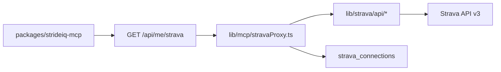

# Roadmap: Strava MCP parity (build our own on top)

Goal: **Replace dependency on [@r-huijts/strava-mcp-server](https://github.com/r-huijts/strava-mcp)** with first-party Strava API tools in StrideIQ, while **keeping and extending** the intelligence layer (Coach brief, readiness, plan, etc.) that strava-mcp does not provide.

**Status: implemented (v0.4.0).** One MCP server + `GET|POST /api/me/strava` covers strava-mcp parity. Smoke: [MCP_STRAVA_SMOKE.md](../MCP_STRAVA_SMOKE.md).

**Baseline was:** ~5/25 strava-mcp tools; now **25/25** via `packages/strideiq-mcp` + 12 intelligence tools.

Related: [MCP_INTEGRATION.md](../MCP_INTEGRATION.md), [packages/strideiq-mcp/README.md](../../packages/strideiq-mcp/README.md).

---

## Principles

1. **Single auth path** — Reuse `strava_connections` + `getValidAccessToken()`; no `~/.config/strava-mcp/` unless we add an optional MCP-only OAuth later.
2. **Thin API, fat product** — `lib/strava/api/*` = HTTP to Strava v3; `lib/mcp/stravaProxy.ts` = routing; MCP = tool names + Zod schemas.
3. **Parity before polish** — Match strava-mcp tool names/inputs where practical; improve formatting in a second pass.
4. **Test at the lib layer** — Vitest on fetch mappers, compact streams, and proxy handler; smoke MCP manually per phase.
5. **Deprecate external server** — Update docs to remove dual-server setup once Phase 4 exit criteria pass.

---

## Architecture (unchanged pattern)



Intelligence tools continue to call `GET /api/me/intelligence` — no merge with Strava proxy.

---

## Phase 0 — Foundation (0.5 week)

**Outcome:** Safe to add many endpoints without rework.

| Task                                                                         | Owner / area                     |
| ---------------------------------------------------------------------------- | -------------------------------- |
| Document tool registry: strava-mcp tool → StrideIQ `action` → MCP name       | This doc § Tool matrix           |
| Extend `StravaMcpAction` union + `ACTIONS` set in route handler              | `app/api/me/strava/route.ts`     |
| Shared `stravaGet(accessToken, path, params?)` helper with consistent errors | `lib/strava/api/client.ts` (new) |
| Rate-limit / 429 handling (retry-after, user-facing message)                 | `lib/strava/api/client.ts`       |
| MCP package version bump policy (0.3.x → 0.4+ per phase)                     | `packages/strideiq-mcp`          |

**Exit criteria**

- [ ] New action added in &lt;30 min (fetch + proxy case + MCP tool + one test)
- [ ] `npm test` + `npm run build` green

---

## Phase 1 — Activity & athlete parity (1–2 weeks)

**Outcome:** ~70% of day-to-day “talk to my Strava” prompts work without external MCP.

### 1.1 API + MCP (expose what exists)

| strava-mcp tool       | StrideIQ action                                          | MCP tool                     | Status                                      |
| --------------------- | -------------------------------------------------------- | ---------------------------- | ------------------------------------------- |
| `getAthleteZones`     | `zones`                                                  | `strava_get_athlete_zones`   | API exists, add MCP                         |
| `getActivityLaps`     | `laps`                                                   | `strava_get_activity_laps`   | Split from streams                          |
| `getRecentActivities` | `activities` + `per_page`                                | `strava_list_activities`     | Add `limit` alias                           |
| `getAllActivities`    | `activities` + `after`/`before` + pagination loop helper | `strava_list_all_activities` | Optional server-side multi-page (cap pages) |

### 1.2 New fetch modules

| Module           | Strava endpoint                                             |
| ---------------- | ----------------------------------------------------------- |
| `fetchPhotos.ts` | `GET /activities/{id}/photos`                               |
| `fetchGear.ts`   | `GET /athlete` (shoes/bikes from athlete or gear endpoints) |

### 1.3 Streams depth (match strava-mcp ergonomics)

| Feature               | Work                                                             |
| --------------------- | ---------------------------------------------------------------- |
| Verbose stream format | `compact=false` already; add structured verbose mapper           |
| Chunking (~50KB)      | `lib/strava/api/streamChunks.ts` — split compact payload for MCP |
| Optional downsampling | Reuse `lib/strava/downsample.ts` for `?downsample=500`           |
| More stream keys      | Extend `STREAM_KEYS` (watts, temp, grade) where scopes allow     |

### 1.4 Activity detail formatting

| Task                              | Notes                                                     |
| --------------------------------- | --------------------------------------------------------- |
| `formatActivitySummary(activity)` | Human-readable block (distance, pace, HR, power) for LLMs |
| `action=activity&format=summary`  | Optional; default remains raw JSON                        |

**Exit criteria**

- [ ] MCP tool list covers: profile, stats, zones, shoes, recent/all activities, activity detail, laps, streams (compact + verbose + chunk), photos
- [ ] [docs/MCP_INTEGRATION.md](../MCP_INTEGRATION.md) tool table updated
- [ ] Manual smoke: 5 prompts from strava-mcp README (“recent activities”, “HR on last ride”, “YTD runs”, “zones”, “laps”)

**Rough parity:** 12–14 / 25 strava-mcp tools.

---

## Phase 2 — Segments (2–3 weeks)

**Outcome:** Segment exploration and efforts — the largest functional gap.

### 2.1 New `lib/strava/api/` modules

| Module                       | Strava API                                                                  |
| ---------------------------- | --------------------------------------------------------------------------- |
| `fetchSegments.ts`           | `GET /segments/{id}`, `GET /segments/starred`, `PUT /segments/{id}/starred` |
| `exploreSegments.ts`         | `GET /segments/explore` (bounds + activity type)                            |
| `fetchSegmentEfforts.ts`     | `GET /segment_efforts/{id}`, `GET /segments/{id}/all_efforts`               |
| `fetchSegmentLeaderboard.ts` | `GET /segments/{id}/leaderboard`                                            |

### 2.2 Proxy actions + MCP tools

| strava-mcp tool         | action                          | MCP tool                         |
| ----------------------- | ------------------------------- | -------------------------------- |
| `exploreSegments`       | `segments_explore`              | `strava_explore_segments`        |
| `listStarredSegments`   | `segments_starred`              | `strava_list_starred_segments`   |
| `getSegment`            | `segment`                       | `strava_get_segment`             |
| `getSegmentLeaderboard` | `segment_leaderboard`           | `strava_get_segment_leaderboard` |
| `getSegmentEffort`      | `segment_effort`                | `strava_get_segment_effort`      |
| `listSegmentEfforts`    | `segment_efforts`               | `strava_list_segment_efforts`    |
| `starSegment`           | `segment_star` (POST via proxy) | `strava_star_segment`            |

**Note:** `starSegment` is a **write** — confirm Strava scopes (`read` vs `read_all` + segment write scope if required).

### 2.3 Product hooks (optional, same phase or 2.5)

- Surface starred segments on **Performance** or **Records** (read-only UI first).
- Cache segment metadata in Neon only if needed for perf (not required for MCP parity).

**Exit criteria**

- [ ] All 7 segment tools pass manual smoke (explore near lat/lng, star, leaderboard, my efforts)
- [ ] Integration test with mocked Strava responses
- [ ] Rate limits documented (explore + leaderboard are sensitive)

**Cumulative parity:** ~21 / 25 tools.

---

## Phase 3 — Routes, clubs, exports (1–2 weeks)

### 3.1 Routes & clubs

| strava-mcp tool     | Module           | action   | MCP tool             |
| ------------------- | ---------------- | -------- | -------------------- |
| `listAthleteRoutes` | `fetchRoutes.ts` | `routes` | `strava_list_routes` |
| `getRoute`          | `fetchRoutes.ts` | `route`  | `strava_get_route`   |
| `listAthleteClubs`  | `fetchClubs.ts`  | `clubs`  | `strava_list_clubs`  |

### 3.2 Exports

| strava-mcp tool     | Implementation                                                                                          |
| ------------------- | ------------------------------------------------------------------------------------------------------- |
| `exportRouteGpx`    | `GET /routes/{id}/export_gpx` → return `{ gpx, filename }` or write to temp path for MCP file resource  |
| `exportRouteTcx`    | `GET /routes/{id}/export_tcx`                                                                           |
| `formatWorkoutFile` | Build GPX/TCX from activity streams (reuse latlng/time) — or defer if route export covers main use case |

**Env:** `ROUTE_EXPORT_PATH` optional for server-side file write; prefer inline base64/JSON for serverless (Vercel).

**Exit criteria**

- [ ] Export GPX for a known route id via MCP
- [ ] Clubs list returns for connected athlete
- [ ] **25/25** strava-mcp tools have a StrideIQ equivalent (see matrix below)

---

## Phase 4 — Auth UX & deprecation (1 week)

### 4.1 MCP connect flow (optional)

Only needed if users **never** open the web app:

| Option          | Description                                                                       |
| --------------- | --------------------------------------------------------------------------------- |
| A (recommended) | Document: “Connect Strava in Settings” + `STRIDEIQ_API_KEY` for MCP               |
| B               | `strava_connect_status` tool + link to `/settings`                                |
| C               | Embedded OAuth on `localhost` for headless MCP (like strava-mcp) — highest effort |

### 4.2 Deprecate external strava-mcp

- Remove `strava` entry from [config/mcp/*.example.json](../../config/mcp/)
- [MCP_INTEGRATION.md](../MCP_INTEGRATION.md): StrideIQ-only path
- README: “Full Strava MCP surface built-in”

**Exit criteria**

- [ ] New user can use MCP with app OAuth + API key only
- [ ] No references requiring `@r-huijts/strava-mcp-server` for documented features

---

## Phase 5 — “On top” (shipped v0.5.0)

| Initiative                    | Status                                                                  |
| ----------------------------- | ----------------------------------------------------------------------- |
| **Intelligence + raw Strava** | `analyze_last_run_with_readiness`, `race_week_snapshot` composite tools |
| **DB-backed list**            | `strava_list_activities` uses Neon when sync &lt;24h fresh              |
| **Segment ↔ analytics**       | `pr_and_segments_snapshot`                                              |
| **Route ↔ plan**              | `long_run_route_suggestions`                                            |
| **Scopes dashboard**          | Settings → Strava & MCP card                                            |
| **MCP resources**             | `strideiq://activity/{id}/gpx`                                          |

---

## Full tool matrix (target)

| #   | strava-mcp            | StrideIQ MCP (target)              | Phase        |
| --- | --------------------- | ---------------------------------- | ------------ |
| 1   | connectStrava         | App OAuth (+ optional status tool) | 4            |
| 2   | getAthleteProfile     | `strava_get_athlete`               | ✅           |
| 3   | getAthleteStats       | `strava_get_athlete_stats`         | ✅           |
| 4   | getAthleteZones       | `strava_get_athlete_zones`         | 1            |
| 5   | getAthleteShoes       | `strava_get_athlete_shoes`         | 1            |
| 6   | getRecentActivities   | `strava_list_activities`           | 1            |
| 7   | getAllActivities      | `strava_list_all_activities`       | 1            |
| 8   | getActivityDetails    | `strava_get_activity` (+ summary)  | 1            |
| 9   | getActivityStreams    | `strava_get_activity_streams`      | 1 (chunking) |
| 10  | getActivityLaps       | `strava_get_activity_laps`         | 1            |
| 11  | getActivityPhotos     | `strava_get_activity_photos`       | 1            |
| 12  | exploreSegments       | `strava_explore_segments`          | 2            |
| 13  | listStarredSegments   | `strava_list_starred_segments`     | 2            |
| 14  | getSegment            | `strava_get_segment`               | 2            |
| 15  | getSegmentLeaderboard | `strava_get_segment_leaderboard`   | 2            |
| 16  | getSegmentEffort      | `strava_get_segment_effort`        | 2            |
| 17  | listSegmentEfforts    | `strava_list_segment_efforts`      | 2            |
| 18  | starSegment           | `strava_star_segment`              | 2            |
| 19  | listAthleteRoutes     | `strava_list_routes`               | 3            |
| 20  | getRoute              | `strava_get_route`                 | 3            |
| 21  | exportRouteGpx        | `strava_export_route_gpx`          | 3            |
| 22  | exportRouteTcx        | `strava_export_route_tcx`          | 3            |
| 23  | listAthleteClubs      | `strava_list_clubs`                | 3            |
| 24  | formatWorkoutFile     | `strava_format_workout_file`       | 3            |
| 25  | getServerVersion      | `strideiq_mcp_version` (optional)  | 0            |

**StrideIQ-only (keep):** `get_coach_brief`, `get_readiness`, `get_predictions`, `get_week_plan`, `get_race_strategy`, `get_fatigue_load`, `list_recent_runs`, `get_data_quality`, `get_connection_status`, `compare_sessions`, `explain_readiness_delta`, `find_best_phase`, `attribute_improvement`, `analyze_fade_pattern`, `pr_context`.

---

## Timeline (indicative)

| Phase                | Duration | Cumulative parity   |
| -------------------- | -------- | ------------------- |
| 0 Foundation         | 0.5 wk   | Enabler             |
| 1 Activity & athlete | 1–2 wk   | ~55% strava-mcp     |
| 2 Segments           | 2–3 wk   | ~85%                |
| 3 Routes & exports   | 1–2 wk   | 100% tools          |
| 4 Deprecation        | 1 wk     | Single-server story |
| 5 “On top”           | Ongoing  | Differentiation     |

**Total to parity:** ~5–8 weeks focused work (one developer), assuming Strava API access and scopes already configured.

---

## Risks & mitigations

| Risk                                                | Mitigation                                                                |
| --------------------------------------------------- | ------------------------------------------------------------------------- |
| Strava rate limits (especially explore/leaderboard) | Central client with backoff; cache segment detail 24h                     |
| Scope gaps (segment write, route read)              | Document required scopes in Settings; fail with clear MCP error           |
| Large stream payloads on serverless                 | Chunking + downsampling default on MCP                                    |
| Vercel response size limits                         | Cap pages on `list_all`; stream chunks as multiple MCP messages if needed |
| Duplicating strava-mcp bugs                         | Cross-check behavior with their tool names in manual smoke script         |

---

## Verification checklist (per phase)

```bash
# Automated
npm test
npm run build
cd packages/strideiq-mcp && npm run build

# Manual (Claude/Cursor with STRIDEIQ_API_KEY)
# See docs/SMOKE_TEST.md — add section "MCP Strava parity"
```

Store parity prompts in `docs/MCP_STRAVA_SMOKE.md` (create in Phase 1).

---

## Success definition

1. **Functional:** All rows in the tool matrix implemented and smoke-tested.
2. **Operational:** Documented scopes, rate limits, and auth path; no required external MCP package.
3. **Product:** Intelligence tools remain first-class; at least one composite flow (Phase 5) ships to prove “on top.”

---

## Suggested first sprint (Phase 0 + 1.1)

1. `lib/strava/api/client.ts` + tests
2. `strava_get_athlete_zones` MCP tool
3. `action=laps` + `strava_get_activity_laps`
4. Stream chunking for long activities
5. `docs/MCP_STRAVA_SMOKE.md` with 10 prompts

After sprint: update [FEATURES.md](../FEATURES.md) §12 and bump `@strideiq/mcp` to **0.4.0**.
